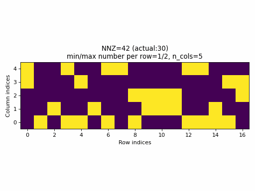
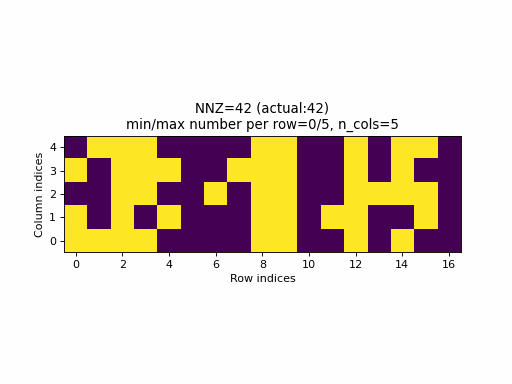

# CSR random sampling

This blog post is inspired by https://github.com/pytorch/pytorch/issues/59379 that seeks
for a better sampling method for generating random CSR tensors to be used for testing PyTorch CSR
tensor support. In the following, we'll review the currently used method, then define what is a good sampling method,
and finally, propose a better sampling method for CSR tensors.

## Current state

At the time of writting this, PyTorch [implements](https://github.com/pytorch/pytorch/blob/8c4e78129ec8d71d587ac5d143ad17e4b95b3576/torch/testing/_internal/common_utils.py#L1068-L1092)
the following algorithm for random CSR tensor samples (here given a slightly modified version for clarity):

```python
# Inputs: n_rows, n_cols, nnz
# Outputs: crow_indices, col_indices, values
nnz_per_row = nnz // n_rows
crow_indices = torch.zeros(n_rows + 1)
if nnz_per_row > 0:
    crow_indices[1:] = nnz_per_row
else:
    crow_indices[1:nnz + 1] = 1
crow_indices.cumsum_(dim=0)
actual_nnz = crow_indices[-1]
col_indices = torch.randint(0, n_cols, size=[actual_nnz])
values = make_tensor([actual_nnz], low=-1, high=1)
```

Pros:
- the algorithm is very simple

Cons:
- while `col_indices` and `values` are random, `crow_indices` are not. This means that this sampler always
  produces CSR tensors with regular `crow_indices` with a specific structure while other possible structures are
  not generated for some fixed `nnz` value no matter how large is the number of samples. For instance, for most of the possible 
- given the input `nnz` does not guarantee that the number of specified values in the example will be the same
  (expect when `nnz` is a integer multiplier of `n_rows`).

As an example, the following animation generates a series of samples with specified `nnz` varying from `0` to `n_rows * c_cols`.



Observations:
- for a wide range of `nnz` values, rows with no entries or rows with all columns specified, are never generated
- only for few specified values of `nnz` equals with the `nnz` of the sample.



