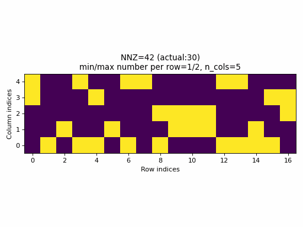
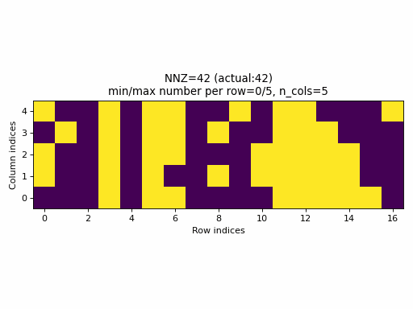
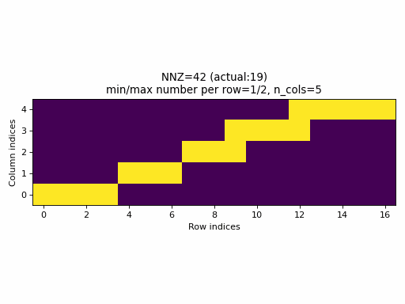
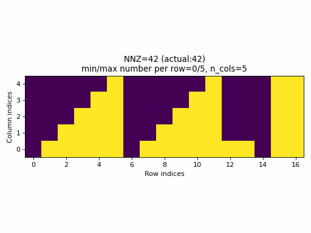

# CSR random sampling

This blog post is inspired by [PyTorch issue 59379](https://github.com/pytorch/pytorch/issues/59379) that seeks
for a better sampling method for generating random CSR tensors to be used for testing PyTorch CSR
tensor support. In the following, we'll review the currently used method, then define what is a good
sampling method for testing purposes, and finally, propose a new sampling method for generating CSR tensors
to be used for testing algorithms using CSR tensors as inputs. It is important to note that
the proposed sampling method is not meant to have specific statistical properties that would be
useful for generating random CSR tensors for other purposes than testing CSR based algorithms.

## Current state

At the time of writting this, PyTorch [implements](https://github.com/pytorch/pytorch/blob/8c4e78129ec8d71d587ac5d143ad17e4b95b3576/torch/testing/_internal/common_utils.py#L1068-L1092)
the following algorithm for sampling CSR tensors (here given a slightly modified version for clarity):

```python
# Inputs: n_rows, n_cols, nnz
# Outputs: crow_indices, col_indices, values
nnz_per_row = nnz // n_rows
crow_indices = torch.zeros(n_rows + 1)
if nnz_per_row > 0:
    crow_indices[1:] = nnz_per_row
else:
    crow_indices[1:nnz + 1] = 1
crow_indices.cumsum_(dim=0)
actual_nnz = crow_indices[-1]
col_indices = torch.randint(0, n_cols, size=[actual_nnz])
values = make_tensor([actual_nnz], low=-1, high=1)
```

Pros:
- the algorithm is very simple

Cons:
- while `col_indices` and `values` are random, `crow_indices` are not. This means that this sampler always
  produces CSR tensors with regular `crow_indices` with a specific structure while other possible structures are
  not generated for some fixed `nnz` value no matter how large is the number of samples. 
- specifying `nnz` does not guarantee that the number of specified values in the generated sample will be equal to `nnz`
  (except when `nnz` is a integer multiple of `n_rows`)
- to achieve a low sparsity samples, one needs to specify larger `nnz` values than `n_rows * n_cols`. This means that
  there is a high chance that the current method produces `crow_indices` that invalidate the 
  [CSR invariant 5.3](https://github.com/pearu/pearu.github.io/blob/main/csr_tensor_invariants.md#indices-invariants).

As an example, the following animation generates a series of samples with specified `nnz` varying from `0` to `n_rows * c_cols`.



Observations:
- for a wide range of `nnz` values, rows with no entries or rows with all columns specified,
  are never generated (min/max number of columns per row is not equal to `0/n_cols`),
- only for few specified values of `nnz`, it will be equal to the actual `nnz` value of the sample (observe the actual NNZ value),
- the distribution of specified elements looks uniform, however, this is not a good property, see the next section below.
- it is practically impossible to generate a CSR sample with a specified density. In fact, the set of possible densities is
  discrete, `set((nnz // n_rows) / n_cols for nnz in range(0, n_rows, n_cols))`, that appears to have size: `n_cols`.

## Quality of random samples for testing

To test the correctness of some functionality in a software, using random samples with uniformly distributed specified elements
is not always the optimal approach: edge cases such as existence of rows with no specified elements or with no unspecified elements,
are practically never generated. However, often only the edge cases may reveal possible bugs in the corresponding
algorithms/implementations.

So, the quality of random samples that are used for testing is not about the quality of the distribution of random placements
of specified elements in the indices space of a sparse tensor. Instead, the quality is about
maximally stressing the algorithms logic with a minimal effort. That is, a *good sample* has the following properties:
- it is small in order to minimize computation time when processing it in the algorithms,
- it will make all possible branches in the algorithm to be alive to maximize testing coverage,
- its structure is highly variable in order reveal any possible shortcomings of the algorithm,
- it must have some intrinsic randomness that will increase the variability of the structure even more when
  tests are run multiple times and/or from different environments,
- finally, its generation must be efficient.

In the case of generating samples of CSR tensors, the current quality of random samples is limited by the quality of `crow_indices`
samples. So, in the following we aim at applying the properties of a good sample specifically to `crow_indices` and
at the same time avoid the structural issues of the current sampler method, e.g., ensure that the actual `nnz`
will be equal to the specified `nnz` parameter.

## Sampling of `crow_indices`

To compute `crow_indices`, we are using the following model:

```python
crow_indices = cumsum([0] + counts)
```

where `counts` is a list of integers with the following properties:

- `len(counts) == n_rows`
- `counts[i]` is the number of specified elements in the `i`-th row
- `0 <= counts.min()` and `counts.max() <= n_cols`
- `counts.sum() == nnz`
- `counts[-1] - counts[0]` is as large as possible to maximize structural variability of row indices
- the distibution of different count values is as uniform as possible to obtain some balance between normal and the edge cases

In addition, we require that the computation of `counts` has complexity not greater than `O(max(n_rows, n_cols))`.

### New algorithm

Clearly, there exists many solutions to `counts` that satisfy the above listed properties.

Here we propose a new algorithm that is based on computing the column `counts` per row
from the following histogram:

```
      ^ count is the height of the histogram
      |
      |

        *   *   *   *   ###
       **  **  **  **+ o###
      *** *** *** ***+oo###
      @@@@@@@@@@@@@@@@@@###
      @@@@@@@@@@@@@@@@@@###      --> row indices
```
where different parts of the histogram are denoted as follows:
- `<space>` - no counts
- `+` - final correction
- `o` - an incomplete sawtooth
- `*` - a sequence of full sawteeth
- `@` - lower rectangle
- `#` - right rectangle

Pseudo-code for computing the above histogram is as follows:

```python
# Inputs: n_rows, n_cols, nnz
# Outputs: counts

counts = zeros(n_rows)

def N(n, m):
    # compute the total number of counts in the sequence of sawteeth
    M = (n_cols - m) * (n_cols - m + 1) // 2
    K = (n_rows - n) % (n_cols - m + 1)
    return M * ((n_rows - n) // (n_cols - m + 1)) + K * (K - 1) // 2

# Find n such that N(n, 0) == 0 or nnz - n * n_cols < max(N(n, 0), n_cols)
if n > 0:
    counts[-n:] = n_cols                        - this fills the region denoted by #

# Find m such that N(n, m) == 0 or nnz - n * n_cols - m * (n_rows - n) < max(N(n, m), n_rows - n)
if m > 0:
    counts[:n_rows - n] = m                     - this fills the region denoted by @

if N(n, m) == 0:  # no sawteeth
    counts[0] = nnz - n * n_cols - m * n_rows
else:
    q, r = divmod(nnz - n * n_cols - m * (n_rows - n), (n_cols - m) * (n_cols - m + 1) // 2)
    p = q * (n_cols - m + 1)
    # Find k such that k*(k+1)/2 <= r
    corr = r - k * (k + 1) // 2
    counts[:p] = arange(p) % (n_cols - m + 1)   - this fills the region denoted by *
    counts[p:p+k+1] += arange(k + 1)            - this fills the region denoted by o
    counts[p] += corr                           - this fills the region denoted by +
```

Notice that the filling of `counts` can use vectorized operations.
To solve the equations `N(n, m) == 0` for integers `n` and `m`, one can use the bisection algorithm.

For example, the following animation uses the above described construction of `crow_indices` for generating random CSR samples:



Observations:
- the `nnz` of the proposed CSR sample is always equal to the specified value of `nnz`, hence, the algorithm guarantees that
  a given density of the sparse tensor is always achievable by choosing `nnz = int(density * n_rows * n_cols)`.
- the CSR sample contains rows with all possible number of columns: `0` to `n_cols` (unless the density is very low or very high when the
  property would not be achievable anyway).


## More comparisons

Another way to compare the sampling methods is to disable randomization. Here follow the
animations of the current and proposed samplings of CSR tensors:




Observations:
- As seen above, the current sampling method in PyTorch produces the same indices structure
  for all `nnz` values. In fact, the sparsity of the CSR tensors is basically constant and it is
  impossible to generate low sparsity CSR samples with the current PyTorch sampling method.
- With the proposed sampling method the variability of indices structure
  is maximized for almost all `nnz` values. The sparsity of CSR samples varies
  within full range (from 0% to 100% of sparsity) when using the proposed sampling method.

## Final notes

The animations produced in this blog post are generated using the Python script [distribute_column_indices.py](data/distribute_column_indices.py).
The same script contains the prototype implementation of the proposed CSR sampling algorithm. For production implementation, see [PyTorch PR 60283](https://github.com/pytorch/pytorch/pull/60283).
